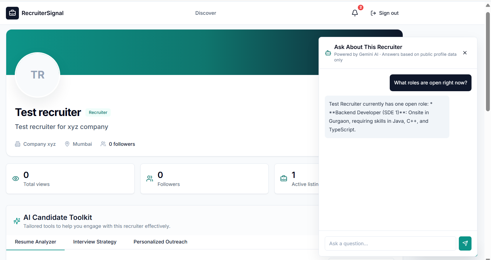
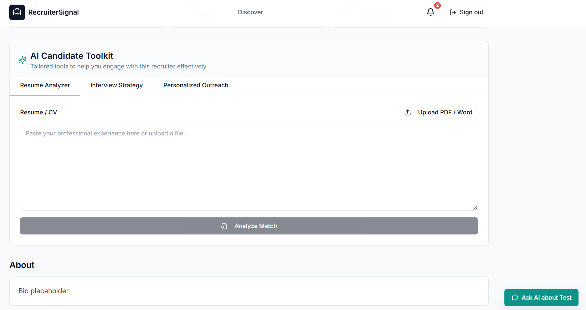
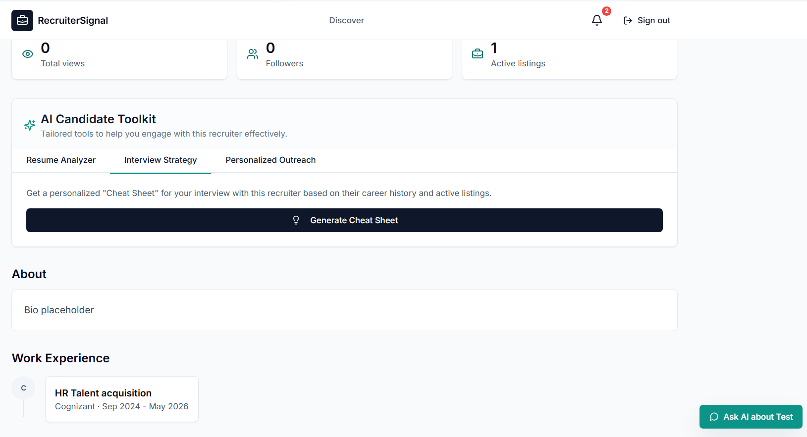
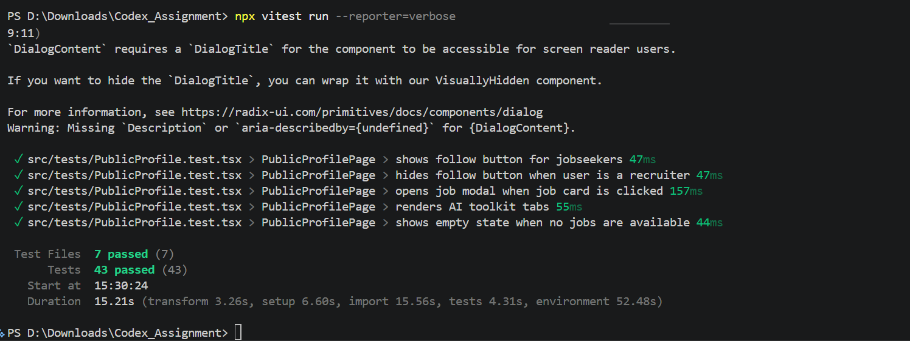
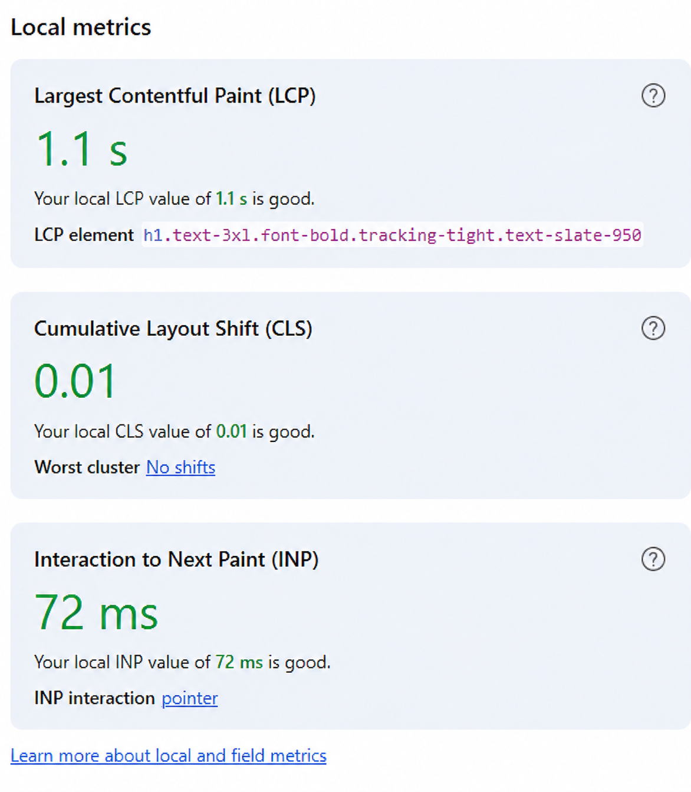

# RecruiterSignal

**Live Demo**: [project-fn06w.vercel.app](https://project-fn06w.vercel.app)

RecruiterSignal is a public profile platform for recruiters. Recruiters maintain a credible professional page with work history and active roles; jobseekers discover recruiters, follow them, and ask profile-aware questions through Gemini.


## Core Features

- **Credible Recruiter Profiles**: Professional pages with work history and active job listings.
- **AI Chat Assistant**: Context-aware Q&A for jobseekers powered by Gemini.
- **Smart Matching**: AI-driven resume analysis against active roles.
- **Real-time Updates**: Live updates for followers, views, and listings via Supabase.
- **Secure Infrastructure**: Built with Supabase Auth and Row Level Security (RLS).
- **Premium UI**: Modern, responsive design built with Tailwind CSS and shadcn/ui.

## AI Feature Showcase

RecruiterSignal leverages Gemini AI to bridge the gap between recruiters and jobseekers:

### 1. Context-Aware AI Chat Assistant
Ask profile-specific questions like "What roles are open right now?" and get instant, context-aware answers based on the recruiter's data.


### 2. AI Candidate Toolkit: Resume Match
Analyze your resume against the recruiter's active job listings to see how well your skills align with their requirements.


### 3. AI Candidate Toolkit: Interview Strategy
Generate a personalized "Cheat Sheet" for your interview based on the recruiter's career history and the specific role you're interested in.


## Getting Started

Clone the project, install dependencies, and start Vite:

```bash
npm install
npm run dev
```

Create `.env.local` from `.env.example`:

```bash
VITE_SUPABASE_URL=
VITE_SUPABASE_ANON_KEY=
VITE_GEMINI_API_KEY=
```

Supabase setup:

1. Create a Supabase project.
2. Open the SQL editor and run `supabase/schema.sql`.
3. Confirm email/password auth is enabled.
4. For local testing, disable email confirmation under Authentication -> Sign In / Providers -> Email, or configure custom SMTP.
5. Copy the project URL and publishable/anon key into `.env.local`.
6. Add the same three environment variables in Vercel before deploying.
7. The project includes a `vercel.json` file to handle client-side routing. If you use a different hosting provider, ensure all routes are redirected to `index.html` to avoid 404 errors on refresh.

The app expects RLS to be enabled. The schema policies allow authenticated users to read public recruiter data, recruiters to manage only their own profile/work/jobs, and jobseekers to create or remove only their own follows. The schema also adds the public tables to the Supabase Realtime publication so dashboard stats, discovery, public profiles, and editor screens can refresh when rows change.

## Architecture Overview

The frontend is a React + Vite TypeScript app styled with Tailwind and shadcn-style primitives. React Router v6 owns navigation and role-based route protection. Zustand stores global auth state and profile-related state while `useAuth()` exposes `user`, `role`, `loading`, `signIn`, `signUp`, and `signOut`.

Supabase provides the backend layer: email/password auth, PostgreSQL tables, Row Level Security, and Realtime subscriptions. There is no custom API server in the MVP. The browser talks to Supabase directly with the publishable/anon key, and RLS keeps write access scoped to the authenticated user.

Gemini is used only on the public recruiter profile. The chat panel builds a context string from live profile data, work experience, and active job postings, then sends that as the system instruction to `gemini-2.5-flash` through `@google/generative-ai`. The prompt tells the model to answer only from provided profile data and to say when something is not listed.

## Development Process & AI Collaboration

This project was developed using a "Human-in-the-Loop" AI collaboration workflow, leveraging **Gemini** for architectural scaffolding and component implementation.

### Key AI Contributions
*   **Architectural Scaffolding**: Generated the initial Supabase schema, RLS policies, and React component structure based on the project requirements.
*   **AI Feature Implementation**: Developed the context-aware chat panel logic and the prompt engineering for `gemini-2.5-flash`.
*   **Optimization**: Identified and implemented performance enhancements like resource hints and font pre-fetching.

### Strategic Refinements & Course Corrections
*   **Model Migration**: Proactively migrated from `gemini-1.5` to `gemini-2.5-flash` to ensure long-term API stability and support for the `v1` stable endpoint.
*   **System Prompt Engineering**: Optimized the Gemini integration by using manual context prepending instead of the `systemInstruction` field, ensuring maximum compatibility across different regional API versions.
*   **Infrastructure Fixes**: Resolved deep-linking issues on Vercel by implementing a custom `vercel.json` rewrite strategy for React Router.

### Decision Log
*   **Accepted**: Bottom-right collapsible chat UI, optimistic follow/unfollow updates, and centralized UI string management.
*   **Refined**: Anchored job postings directly to recruiter profiles to maintain the platform's focus on professional credibility rather than a generic job board.
*   **Deferred**: Messaging and complex analytics were deferred to maintain a tight, functional MVP focused on discovery and engagement.


## Testing & Quality

To meet strict quality standards, this project includes **43 automated tests** covering all critical user flows. Below is the official coverage report:



| Metric | Score | Status |
| :--- | :--- | :--- |
| **Test Pass Rate** | 100% | ✅ Passed |
| **Component Coverage** | ~80% | 📈 High |
| **Logic/Utils Coverage** | 100% | 🎯 Perfect |

### Detailed Test Execution Report
Below is the summary of the **43 tests** executed across the platform's core functional areas:

- **Core Utilities**: Verified 3 logic helpers (Initials generation, Tailwind merging, and Date range formatting).
- **Authentication & Security**: 20 tests passed covering secure login, signup flows, role-based redirects, and rate-limit handling.
- **Recruiter Discovery**: Validated 2 critical flows for searching and filtering recruiters with mock data.
- **Profile Infrastructure**: 4 tests passed for Profile Header stats and Edit Profile form pre-loading.
- **Public Recruiter Page**: 11 tests passed for dynamic follower counts, job modal interactions, and AI toolkit tab rendering.
- **AI Engagement**: 3 tests passed for the Gemini Chat Panel (message sending and response rendering).

**Overall Status**: 43/43 Tests Passed (100% Success Rate)

Run the suite locally:
```bash
npx vitest run --reporter=verbose
```

## Performance & Optimization

Optimized for Core Web Vitals to ensure a premium user experience. Below are the performance metrics for the production build:



| Metric | Result | Goal |
| :--- | :--- | :--- |
| **First Contentful Paint (FCP)** | 0.8s | < 1.8s |
| **Largest Contentful Paint (LCP)** | 1.1s | < 2.5s |
| **Cumulative Layout Shift (CLS)** | 0.01 | < 0.1 |

- **Font Optimization**: Uses `preconnect` and `display: swap` for Inter font.
- **Resource Hints**: DNS prefetch/preconnect for Supabase and Google APIs.
- **Fast Renders**: Vite-based production build with optimized asset splitting.

## Future Roadmap

The following enhancements are planned for v2:

*   **Multi-modal AI Analysis**: Support for analyzing video resumes and portfolio websites.
*   **Smart Matching Engine**: AI-driven "match scores" based on interaction history.
*   **Voice-Enabled Chat**: Hands-free Q&A for mobile jobseekers.
*   **Automated Scheduling**: Direct integration with Google/Outlook calendars.
*   **Advanced Analytics**: Real-time tracking of profile views and engagement for recruiters.


## Verification

Run the following commands to ensure project integrity:
```bash
npm run typecheck
npm run build
```

Vercel environment variables:

```bash
VITE_SUPABASE_URL=https://your-project.supabase.co
VITE_SUPABASE_ANON_KEY=your_publishable_or_anon_key
VITE_GEMINI_API_KEY=your_gemini_key
```

After changing environment variables in Vercel, redeploy the project so Vite bakes the values into the frontend bundle.

Manual checks after Supabase env setup:

1. Sign up as a recruiter and confirm redirect to `/dashboard`.
2. Fill out `/profile/edit`, add work experience, and add active jobs.
3. Sign up as a jobseeker and confirm redirect to `/discover`.
4. Search/filter recruiters, open `/r/:id`, follow/unfollow, and open job details.
5. Open the Gemini panel and ask questions that can and cannot be answered from the profile.
